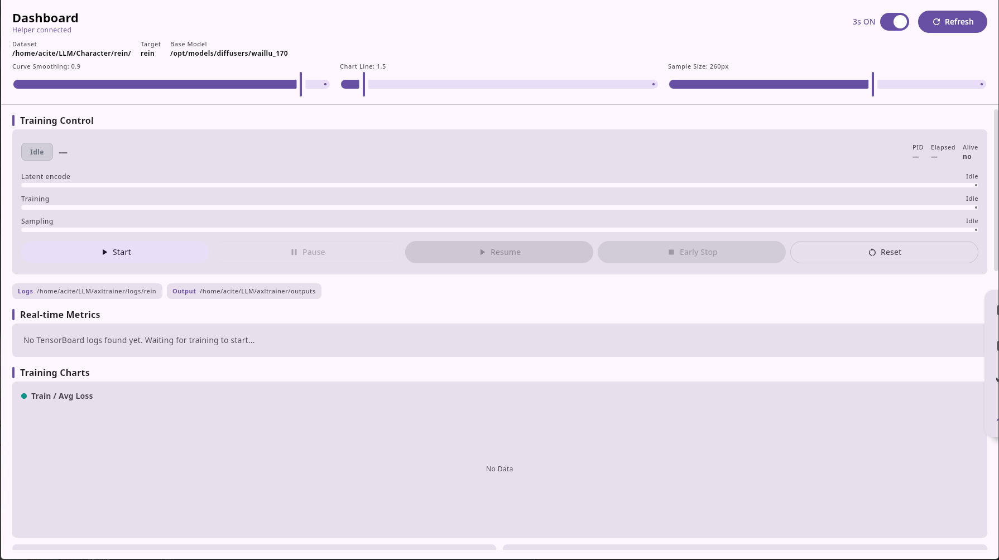

# AXLTrainer

AXLTrainer is a complete, local-first **SDXL LoRA training stack** for people who train on AMD GPUs and don't want to live in the terminal: a kohya-style Python training engine, a desktop dashboard that controls it, and a set of dataset tools — all integrated into one application.

## Why this project exists

Training a LoRA is an iterative, hands-on process — curate a dataset, tag it, train for hours, inspect the samples, adjust, repeat. The existing ecosystem makes that loop painful in three ways:

- **AMD ROCm is second-class.** Mainstream tools (kohya sd-scripts and its derivatives) are built for NVIDIA/CUDA first. On AMD hardware they crash or run poorly in subtle ways, and the fixes are buried in driver-level knowledge — for example, `bucket_reso_steps` must be a multiple of 16 on ROCm or you get random GPU page faults ([details](doc/troubleshooting.md)).
- **The workflow is fragmented.** Config lives in hundreds of CLI flags, monitoring means juggling TensorBoard, a file manager, and sample folders, and dataset management (captioning, tag cleaning, filtering) is scattered across one-off scripts with no unified view.
- **The tooling is hostile to iteration.** No visibility into what the run is doing, no way to pause and reclaim your GPU for something else, no safe reset.

AXLTrainer addresses this by making the entire loop work well on AMD GPUs inside a single friendly desktop app: an intuitive dataset manager, a validated config editor, live training charts with pause/resume/early-stop, and a control plane that keeps training running even when the GUI is closed.

## Table of contents

- [Design & architecture](#design--architecture)
- [Runtime environment & dependencies](#runtime-environment--dependencies)
- [Quick start](#quick-start)
- [Screenshots](#screenshots)
- [Key features](#key-features)
- [Documentation](#documentation)
- [Testing](#testing)
- [License](#license)

---

## Design & architecture

The project is split into four cooperating pieces:

| Layer | Path | Role |
| --- | --- | --- |
| **Training engine** | `trainer/` | Headless, config-driven SDXL LoRA trainer (dataset, latent cache, training loop, sampling, GPU offload, control plane). Entry point: `trainer/main.py`, launched by `start_train.sh`. |
| **Control plane / IPC** | `api.py`, `trainer/control.py` | `api.py` is a small NDJSON-over-stdin/stdout helper that Ranko spawns. The trainer publishes status to a runtime dir (`state.json`) and consumes one-shot commands (`command.json`, `train.lock`); `api.py` bridges the two and reads TensorBoard metrics + sample images. |
| **Desktop dashboard** | `ranko/` | Kotlin/Compose Multiplatform app ("AxlRanko"): dataset caption editor, tag statistics + bulk cleanup, `config.toml` editor, and the training dashboard. |
| **Dataset tooling** | `tools/`, `tagger/`, `ranko/tools/agent.py` | CLI utilities for caption cleaning/filtering/counting, an ONNX auto-tagger, and a machine-friendly dataset CLI for scripts/agents. |

```
┌─────────────────────────────┐         ┌──────────────────────────────┐
│  Ranko (desktop GUI)        │         │  bash start_train.sh         │
│  ranko/  (Kotlin/JVM)       │         │  └─ python -u trainer/main.py│
│                             │         │     (detached, setsid)       │
│  ┌──────────────┐  NDJSON   │         │     │                        │
│  │ api.py       │◄──────────┤         │     ▼                        │
│  │ (IPC helper) │  stdin/   │         │  trainer/control.py          │
│  └──────┬───────┘  stdout   │         │  state.json / command.json / │
│         │                   │         │  train.lock  (runtime dir)   │
│         └── reads ── TensorBoard logs (logging_dir)                  │
│         └── reads ── sample PNGs (output_dir/*_samples)              │
└─────────────────────────────┘
```

Key design decisions:

- **Configuration is TOML-only.** `trainer/main.py` takes no CLI arguments; `trainer/config.toml` is the single source of truth (with fallbacks in `trainer/config.py`).
- **Training is detached.** `api.py` spawns the trainer with `setsid`, so closing the GUI never stops a run. The dashboard controls it through `command.json` at swap-safe points.
- **Pause actually frees your GPU.** Pause offloads UNet, text encoders, optimizer state (including Schedule-Free) and VAE to CPU and calls `empty_cache`; resume reloads them.
- **Checkpoints are ComfyUI-ready.** PEFT state dicts are remapped to kohya `lora_unet_*` / `lora_te1_*` / `lora_te2_*` keys, bf16, with `modelspec.*` + `ss_*` metadata.

Full data flow, lifecycle diagrams, and per-module detail: [Overview](doc/overview.md).

### Repository layout

| Path | What it is |
| --- | --- |
| `trainer/` | The training engine (config, dataset, latent cache, training loop, sampling, GPU offload, control plane). |
| `api.py` | NDJSON-over-stdin/stdout helper process; reports metrics/samples/state, forwards start/pause/resume/stop/reset commands. |
| `ranko/` | Kotlin/Compose Multiplatform desktop app (dataset editor, statistics, config editor, training dashboard). |
| `clean.py` | Interactive CLI cleanup of a run's samples, TensorBoard logs, and (optionally) LoRA checkpoints. |
| `ui.py` | **Deprecated** Streamlit read-only viewer (kept for reference; use the dashboard instead). |
| `tools/` | Dataset utility scripts: tag removal, sample dropping, tag filtering/counting, caption editors, dataset shuffling. |
| `tagger/` | ONNX (WD-tagger style) caption generator for a folder of images. |
| `text_processing.py` | Long-prompt chunking and dual-encoder (SDXL) prompt encoding used by the trainer. |
| `start_train.sh` | Launcher for training; sets AMD/ROCm env vars and filters noisy driver logs. |
| `start_api.sh` | Debug launcher for `api.py` on stdin/stdout. |
| `API.md` | The IPC protocol reference (framing, all methods, request/response shapes). |
| `fixes/` | Field reports of resolved issues (e.g. the ROCm bucket-step alignment crash). |
| `environment.yml` | Conda environment manifest (the only dependency manifest in the repo). |

---

## Runtime environment & dependencies

**Python side (training engine + IPC):**

- Python 3.12 (3.11+ works; `tomllib` is used for config and `agent.py`).
- Managed by conda: `conda env create -f environment.yml` (env name `axl`). There is **no `requirements.txt`** — `environment.yml` is the only Python manifest.
- Key pinned deps: PyTorch `2.12.0+rocm7.2` (torch/torchvision/torchaudio), diffusers 0.38.0, transformers 4.57.6, peft 0.19.1, accelerate 1.13.0, schedulefree 1.4.1, safetensors, tensorboard.
- **Primary target is AMD ROCm** (MIOpen/MIGraphX). The training code is standard PyTorch/diffusers, so CUDA works too with an equivalent `torch` build — see [Installation](doc/installation.md#nvidia--cuda-instead-of-rocm).
- A GPU with enough VRAM for SDXL LoRA training at your chosen resolution and batch size.

**Desktop dashboard (Ranko):**

- JDK 17+ (the Gradle wrapper auto-provisions a JDK 21 toolchain via the foojay resolver), Gradle 9.1.0 wrapper.
- Kotlin 2.4.0, Compose Multiplatform 1.11.1, Material 3, ktoml, kotlinx.serialization, Coil 3.
- The trainer repo must be discoverable by walking up from the executable/cwd (it looks for `api.py` or `trainer/config.toml`), and `python3` with the trainer deps must be on `PATH` (or set `AXL_PYTHON`).

Full setup instructions, dataset preparation, and verification steps: [Installation](doc/installation.md).

---

## Quick start

```bash
# 1. Create the conda environment (Python 3.12, ROCm PyTorch, all training deps)
conda env create -f environment.yml      # env name: axl
conda activate axl

# 2. Point the config at YOUR model, dataset, and output paths
#    (the shipped values are the author's local machine — they will NOT work elsewhere)
vim trainer/config.toml

# 3. Make sure your dataset is ready:
#    one folder of images, each with a same-named .txt caption (comma-separated tags)

# 4. Train from the command line
bash start_train.sh

# or run the desktop dashboard (builds the GUI, spawns api.py, lets you start/pause/stop from a UI)
cd ranko && ./gradlew :desktopApp:run

# 5. Watch progress
tensorboard --logdir "$(grep logging_dir trainer/config.toml | head -1 | cut -d'\"' -f2)"
```

The trainer reads **everything** from `trainer/config.toml` — there are no command-line arguments. See [Configuration](doc/configuration.md) for the full reference.

---

## Screenshots

| Dashboard — live training run | Dashboard — idle |
| --- | --- |
|  |  |

| Images — caption editor | Statistics — tag analysis |
| --- | --- |
|  |  |

| Utils — config editor | |
| --- | --- |
|  | |

---

## Key features

**Training engine**
- SDXL LoRA training via diffusers/PEFT, bf16 mixed precision, outputs ComfyUI-compatible kohya-format `.safetensors`.
- Dual optimizers: Schedule-Free AdamW for the UNet, plain AdamW for both text encoders, per-group LR, warmup + cosine decay.
- Aspect-ratio **bucketing** (`bucket_reso_steps`, min/max resolution); auto-adjusts batch grouping per bucket. ROCm-safe by default (`bucket_reso_steps = 128`).
- **Latent caching**: optional pipelined pre-encode (CPU decode → batched VAE encode → atomic `.pt` write) before training; on-demand encode during training as fallback.
- **Long-prompt support**: prompts beyond 77 tokens are chunked and encoded with `clip_skip`, up to `max_token_length`.
- **Pause / resume / early stop** from the dashboard or IPC: GPU weights offload to CPU and reload at swap-safe points; training keeps running even if the GUI closes.
- Periodic **sample generation** with negative prompt, configurable repeat/seed, and interruptible denoising.
- Kohya-style metadata (`modelspec.*`, `ss_*`) embedded in checkpoints; `Train/Avg_Loss` epoch-window logging.

**Desktop dashboard (Ranko)**
- Images tab: thumbnail browser + caption editor with unsaved-change tracking.
- Statistics tab: tag frequency bars, AND/OR filtering, bulk tag removal / batch add / probabilistic sample dropping.
- Utils tab: structured editor for `trainer/config.toml` with validation and path browsing.
- Dashboard tab: live metrics, interactive charts, sample gallery, and full training control (Start / Pause / Resume / Early Stop / Reset).

**Dataset tooling**
- CLI utilities for caption cleaning, tag filtering/counting, sample dropping, dataset shuffling, and a Qt caption editor.
- ONNX tagger for auto-captioning image folders.
- `ranko/tools/agent.py`: a machine-friendly CLI mirroring the app's dataset features, for scripts and AI agents.

---

## Documentation

| Guide | Contents |
| --- | --- |
| [Overview](doc/overview.md) | What the pieces are, how they fit together, training data flow, process model. |
| [Installation](doc/installation.md) | Environment setup, prerequisites, first run, running the test suites. |
| [Configuration](doc/configuration.md) | Every `trainer/config.toml` section and key, with defaults and practical notes. |
| [Training](doc/training.md) | Running training from the CLI, the run lifecycle, pause/resume/early-stop semantics, checkpoint & sample layout, GPU offloading, cleanup. |
| [Dashboard](doc/dashboard.md) | The Ranko desktop app: each tab, building/running, how it talks to the trainer, train controls, keyboard & chart interactions. |
| [Dataset tools](doc/dataset-tools.md) | `tools/` scripts, the `tagger/` ONNX tagger, and the `ranko/tools/agent.py` CLI for scripted/agent dataset management. |
| [Troubleshooting](doc/troubleshooting.md) | Known issues (including the ROCm bucket-step rule), environment variables, common failure modes. |
| [API.md](API.md) | Full IPC protocol reference. |

---

## Testing

```bash
# Python: IPC + train-control state machine
python -m unittest test_api_ipc test_train_control

# Python: latent-cache equivalence tests (mock VAE; add --real for a real VAE smoke test)
python trainer/test_warm_latent_cache.py [--real]

# Kotlin: Ranko unit tests (serialization / IPC models)
cd ranko && ./gradlew :shared:jvmTest
```

See [Installation](doc/installation.md#running-the-tests) for details.

---

## License

MIT — see [LICENSE](LICENSE).
