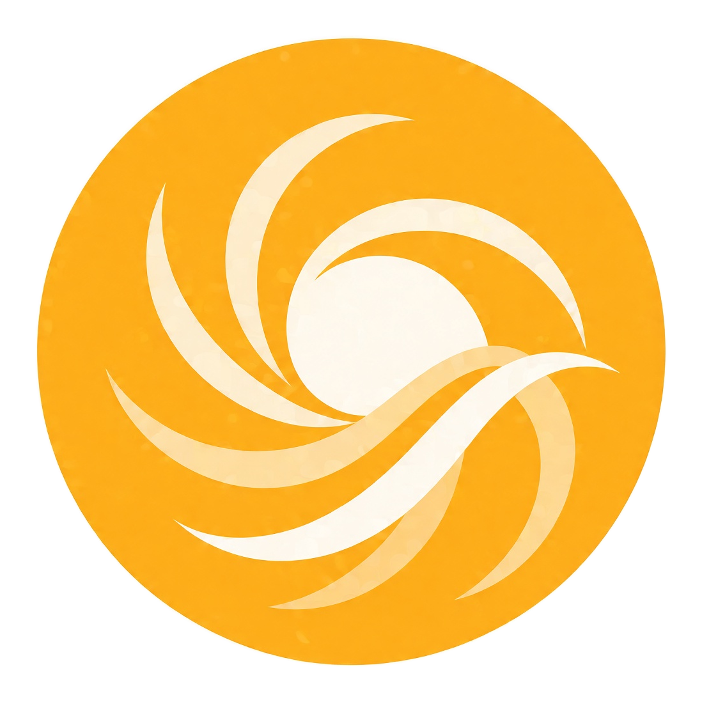
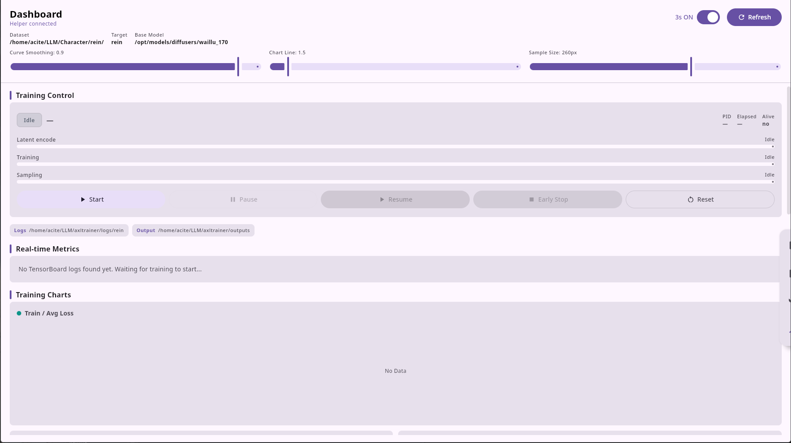

<p align="center">
  
</p>

<h1 align="center">AXLTrainer</h1>

<p align="center">
  <strong>Local LoRA · AMD first</strong><br/>
  A local-first LoRA training stack: a kohya-style Python engine, a desktop dashboard that controls it, and a set of dataset tools — one application, no cloud control plane.
</p>

<p align="center">
  SDXL today · SD 3.5 catalogued · Desktop JVM · ROCm
</p>

---

## What this is

AXLTrainer is for people who train LoRAs on their own machine — especially on AMD GPUs — and do not want the loop of curating, tagging, training, inspecting samples, and adjusting to live entirely in the terminal. The training engine is a headless Python process driven by a single TOML file. Ranko, the Kotlin/Compose desktop app, is the place you actually sit: captions, tag statistics, config, live charts, sample galleries, and start / pause / resume / early-stop. Dataset scripts and an ONNX tagger sit beside both.

The project exists because that loop is painful in three ways that the mainstream stack does not treat as first-class.

- **AMD ROCm is second-class.** Tools built around kohya sd-scripts assume NVIDIA/CUDA. On AMD they crash or degrade in ways that only show up as driver-level knowledge — for example `bucket_reso_steps` must keep VAE latents divisible by 16 on ROCm, or you get random GPU page faults ([details](doc/troubleshooting.md)).
- **The workflow is fragmented.** Config is hundreds of CLI flags, monitoring means TensorBoard plus a file manager plus a samples folder, and captioning / tag cleaning / filtering are one-off scripts with no shared view of the dataset.
- **The tooling is hostile to iteration.** There is little visibility into what a run is doing, no way to pause and actually reclaim the GPU, and no safe reset of a finished run's artifacts.

AXLTrainer keeps the entire loop on one machine, inside one desktop app, with a control plane that does not die when the GUI closes. SDXL is implemented; SD 3.5 is a catalog and UI slot, not a trainer yet.

The rest of the design follows from four decisions:

- **Configuration is TOML-only.** `trainer/main.py` takes no CLI arguments. `config.toml` at the repo root is the single source of truth (with fallbacks in `trainer/config.py`); it is read relative to the working directory, which is always the repo root.
- **Training is detached.** `api.py` spawns the trainer with `setsid`, so closing Ranko never stops a run. The dashboard talks to it through one-shot `command.json` files at swap-safe points.
- **Pause actually frees the GPU.** Pause offloads the denoise network, the text encoders, both optimizers (including Schedule-Free state) and the VAE to CPU, then calls `empty_cache`. Resume reloads what the current phase needs.
- **Checkpoints are ComfyUI-ready.** PEFT state dicts are remapped to kohya `lora_unet_*` / `lora_te1_*` / `lora_te2_*` keys, stored as bf16, with `modelspec.*` and `ss_*` metadata.

<p align="center">
  
</p>

## Features

What stands out when you use the stack, rather than a complete inventory of every toggle.

- **An SDXL LoRA engine that targets AMD.** Mixed precision defaults to bf16. Dual optimizers: Schedule-Free AdamW on the UNet (no LR scheduler) and AdamW on both text encoders with cosine warmup via Accelerator. Aspect-ratio bucketing is ROCm-safe by default (`bucket_reso_steps = 128`) and **letterboxes instead of cropping**: the whole image is fitted into its bucket and the leftover bars carry zero loss weight, so a tall full-body drawing keeps its head and feet. Optional pipelined latent caching (CPU decode → batched VAE encode → atomic `.pt`) runs before training; on-demand encode is the fallback.
- **Long prompts, samples, and kohya metadata.** Prompts past 77 tokens are chunked with `clip_skip` up to `max_token_length`. Periodic sample generation takes a negative prompt, a repeat/seed, and can be interrupted. Checkpoints embed `modelspec.*` / `ss_*` and log a kohya-style `Train/Avg_Loss` window.
- **A dashboard that is the control plane, not a spectator.** Ranko talks to `api.py` over a loopback WebSocket (JSON-RPC), reads TensorBoard scalars and sample PNGs, and offers Start / Pause / Resume / Early Stop / Reset. Progress bars cover latent encoding, training steps, and sampling. Closing the window does not kill the run.
- **Dataset work in the same window.** The Images tab is a thumbnail browser and caption editor with unsaved-change tracking. Statistics scans tag frequency, filters with AND/OR, and bulk-removes tags, batch-adds tags, or probabilistically drops samples. Utils is a structured editor for `config.toml` with validation, path browsing, and saved config presets.
- **CLIs for scripts and agents.** `tools/` covers caption cleaning, tag filtering/counting, sample dropping and shuffling. `tagger/` is an ONNX WD-style captioner. `ranko/tools/agent.py` mirrors the app's dataset features for non-interactive use.

<p align="center">
  
</p>

<p align="center">
  
</p>

<p align="center">
  
</p>

<p align="center">
  
</p>

---

## Design and architecture

Four pieces cooperate. Ranko never talks to the GPU; it only speaks JSON-RPC to `api.py` and renders responses.

| Layer | Path | Role |
| --- | --- | --- |
| **Training engine** | `trainer/` | Headless, config-driven SDXL LoRA trainer (dataset, latent cache, loop, sampling, GPU offload, control plane). Entry: `trainer/main.py`, launched by `start_train.sh`. |
| **Control plane / IPC** | `api.py`, `trainer/control.py` | Ranko spawns `api.py`. The trainer publishes `state.json` and consumes `command.json` / `train.lock`; `api.py` bridges the two and reads TensorBoard + samples. |
| **Desktop dashboard** | `ranko/` | Compose Multiplatform app (**AxlRanko**): captions, tag statistics, config editor, training dashboard. |
| **Dataset tooling** | `tools/`, `tagger/`, `ranko/tools/agent.py` | Caption/tag CLIs, an ONNX auto-tagger, and a machine-friendly dataset CLI. |

```
┌─────────────────────────────┐         ┌──────────────────────────────┐
│  Ranko (desktop GUI)        │         │  bash start_train.sh         │
│  ranko/  (Kotlin/JVM)       │         │  └─ python -u trainer/main.py│
│                             │         │     (detached, setsid)       │
│  ┌──────────────┐  WebSocket│         │     │                        │
│  │ api.py       │◄──────────┤         │     ▼                        │
│  │ (JSON-RPC)   │  loopback │         │  trainer/control.py          │
│  └──────┬───────┘           │         │  state.json / command.json / │
│         │                   │         │  train.lock  (runtime dir)   │
│         └── reads ── TensorBoard logs (logging_dir/{run_id})         │
│         └── reads ── sample PNGs (output_dir/{run_id}/*_samples)     │
└─────────────────────────────┘
```

Full data flow, lifecycle diagrams, and per-module detail: [Overview](doc/overview.md).

### Repository layout

| Path | What it is |
| --- | --- |
| `trainer/` | Training engine (config, dataset, latent cache, loop, sampling, GPU offload, control plane). |
| `api.py` | JSON-RPC helper (WebSocket); metrics, samples, dataset/config IO, start/pause/resume/stop/reset. |
| `ranko/` | Compose Multiplatform desktop app. |
| `clean.py` | Interactive cleanup of samples, TensorBoard logs, and optional LoRA checkpoints. |
| `ui.py` | **Deprecated** Streamlit viewer — use Ranko. |
| `tools/` | Dataset scripts: tag removal, sample dropping, filtering/counting, caption editors, shuffling. |
| `tagger/` | ONNX (WD-tagger style) caption generator for a folder of images. |
| `text_processing.py` | Long-prompt chunking and dual-encoder (SDXL) prompt encoding. |
| `start_train.sh` | Training launcher; AMD/ROCm env and driver-log filters. |
| `start_api.sh` | Debug launcher for `api.py` on a loopback WebSocket. |
| `API.md` | IPC protocol (framing, methods, request/response shapes). |
| `archive/` | Sealed research and field-report bundles (gpg-encrypted). 涉及负责任披露流程，暂不公开 |
| `environment.yml` | Conda manifest — the only Python dependency file in the repo. |

---

## Building and running

There is no `requirements.txt`. Create the conda environment from the manifest (env name `axl`, read from `environment.yml`'s `name:`), point `config.toml` at **your** model, dataset and output paths — the shipped values are the author's machine and will not work elsewhere — then either train from the shell or open Ranko.

```bash
conda env create -f environment.yml
conda activate axl

# edit config.toml  (model / dataset / output paths)

# dataset: one folder of images, each with a same-stem .txt caption (comma-separated tags)

bash start_train.sh

# or the desktop dashboard
cd ranko && ./gradlew :desktopApp:run
# hot reload while developing Ranko
# ./gradlew :desktopApp:hotRun --auto
```

The trainer reads **everything** from `config.toml` at the repo root. See [Configuration](doc/configuration.md) and [Installation](doc/installation.md). Ranko locates the repo by walking up from the executable / working directory until a directory holds `api.py` (or `config.toml` next to the `trainer/` package), then runs `$AXL_PYTHON` or `python3 -u api.py`.

### Tests

```bash
# Python: every suite under test/ (cwd = repo root, env `axl`)
python -m unittest discover -s test
python -m unittest discover -s test -p 'test_family.py'   # one file

# Latent-cache equivalence (mock VAE; add --real for a real VAE smoke test)
python test/test_warm_latent_cache.py [--real]

# Ranko (serialization / IPC models / TOML patch)
cd ranko && ./gradlew :shared:jvmTest
```

Details: [Installation](doc/installation.md#running-the-tests).

---

## Runtime environment

**Python (engine + IPC).** Python 3.14 (3.11+ works; `tomllib` is used). Key pins in `environment.yml`: PyTorch `2.13.0+rocm10.0.0` (gfx1201 extra, AMD `whl-next` index), diffusers 0.40.0, transformers 5.16.1, peft 0.20.0, accelerate 1.14.0, schedulefree 1.4.1, safetensors, tensorboard. The primary target is **AMD ROCm** (MIOpen/MIGraphX). The training code is ordinary PyTorch/diffusers, so CUDA works with an equivalent `torch` build — see [Installation](doc/installation.md#nvidia--cuda-instead-of-rocm). You still need enough VRAM for SDXL LoRA at the resolution and batch size you chose.

**Ranko.** JDK 17+ (the Gradle wrapper provisions a JDK 21 toolchain), Gradle 9.1.0 wrapper, Kotlin 2.4.10, Compose Multiplatform 1.12.0, Material 3, ktoml, kotlinx.serialization, Coil 3.

### Author's development machine

Provided as a reference, not a requirement. This is also the machine on which the [ROCm bucket-step fix](doc/troubleshooting.md) was validated (a full 1200+ step run with sampling).

| Component | Details |
| --- | --- |
| OS | Arch Linux (rolling), kernel `7.1.9-zen1-2-zen` |
| CPU | Intel Core i7-14700F (20 cores / 28 threads) |
| RAM | 32 GB |
| GPU | AMD Radeon RX 9070 XT 16 GB GDDR6 (Navi 48 / RDNA4, PowerColor) |
| ROCm stack | ROCm 10.0.0 (HIP 7.15.26333, vendored via `rocm-sdk-*` wheels) |
| Java | OpenJDK 26.0.2.1 (system JVM; Ranko's Gradle daemon uses the provisioned JDK 21 toolchain) |
| Python | 3.14.7 (conda env `axl`, CPython `cp314`) |
| torch / torchvision / torchaudio | `2.13.0+rocm10.0.0` / `0.28.0+rocm10.0.0` / `2.11.0.2+rocm10.0.0` |
| diffusers / transformers / peft / accelerate | `0.40.0` / `5.16.1` / `0.20.0` / `1.14.0` |
| schedulefree / safetensors | `1.4.1` / `0.8.0` |
| tensorboard / streamlit | `2.21.0` / `1.63.0` |
| onnxruntime-migraphx / triton | `1.27.1` / `3.8.0+git4cff872c.rocm10.0.0` |
| kornia / opencv-python / numpy / pillow | `0.8.3` / `5.0.0.93` / `2.5.3` / `12.3.0` |

> Versions above are what is installed in `axl` at the time of writing and may drift slightly; `environment.yml` is the pinned record.

---

## Documentation

| Guide | Contents |
| --- | --- |
| [Overview](doc/overview.md) | Pieces, data flow, process model. |
| [Installation](doc/installation.md) | Environment, first run, test suites. |
| [Configuration](doc/configuration.md) | Every `config.toml` section and key. |
| [Training](doc/training.md) | CLI runs, lifecycle, pause/resume/stop, checkpoints, offload, cleanup. |
| [Dashboard](doc/dashboard.md) | Ranko tabs, IPC, train controls, charts. |
| [Dataset tools](doc/dataset-tools.md) | `tools/`, `tagger/`, `ranko/tools/agent.py`. |
| [Mask verification](doc/mask-verification.md) | Closed-loop verification of the loss-mask pipeline: what it asserts, status, restart runbook. |
| [Troubleshooting](doc/troubleshooting.md) | ROCm bucket-step rule, env vars, common failures. |
| [API.md](API.md) | IPC protocol. |

---

## License

MIT — see [LICENSE](LICENSE).
