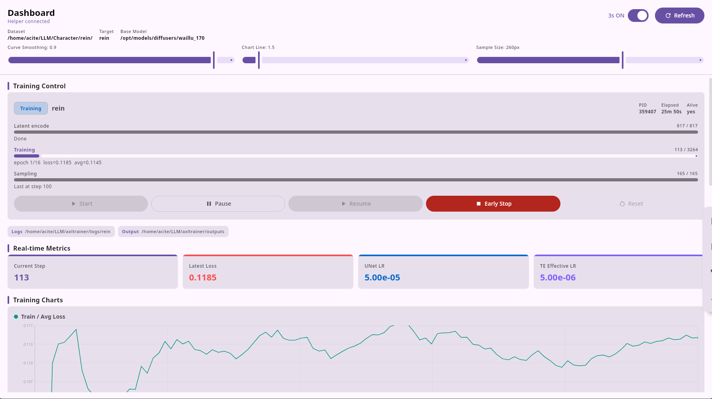
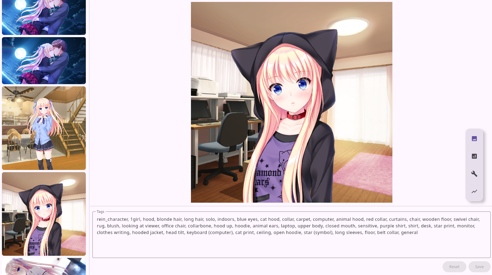
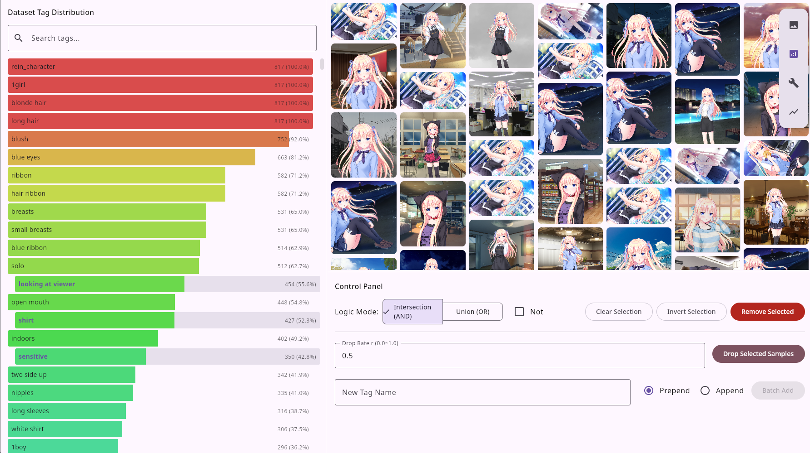
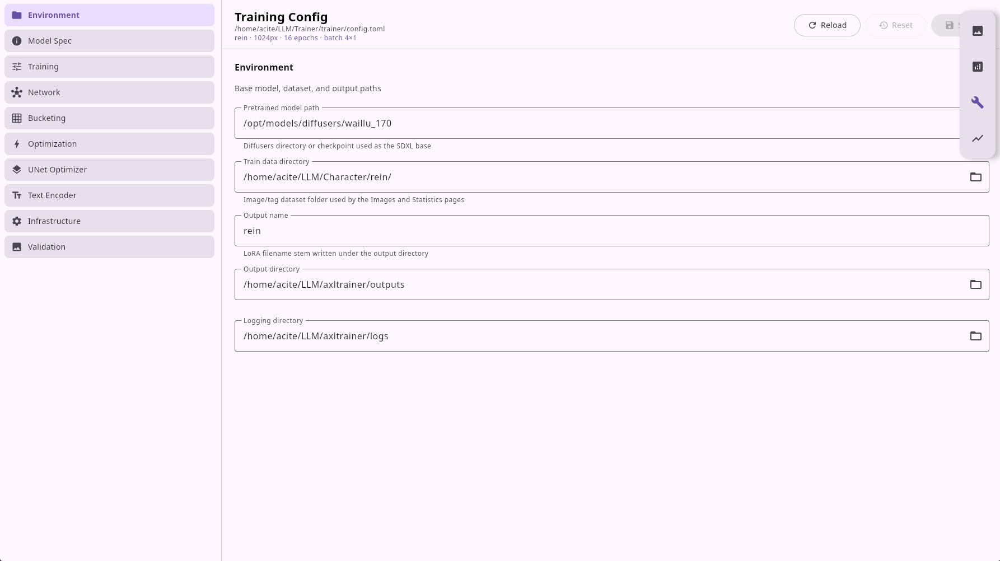

# Dashboard (Ranko)

Ranko ("AxlRanko") is the desktop GUI, built with Kotlin Multiplatform + Compose Multiplatform (JVM desktop target). It is a **controller, not a trainer**: it manages the dataset, edits the config, and drives the detached Python training process through the IPC helper (`api.py`).



## Requirements

- JDK 17+ (the Gradle wrapper auto-provisions a JDK 21 toolchain through the foojay resolver if needed).
- Python with the trainer deps on `PATH` as `python3`, or set `AXL_PYTHON` to the interpreter to use (recommended when using the `axl` conda env).
- The trainer repo must be discoverable: Ranko walks up from the executable and from the working directory looking for a folder containing `api.py` or `trainer/config.toml`. Running `./gradlew :desktopApp:run` from inside the repo satisfies this.

## Build and run

```bash
cd ranko
./gradlew :desktopApp:run            # standard dev run
./gradlew :desktopApp:hotRun --auto  # Compose hot reload
./gradlew :shared:jvmTest            # unit tests
./gradlew :desktopApp:packageDeb     # package an installer (also: packageDmg / packageMsi)
```

## The four tabs

The app opens with a floating, draggable navigation rail (Images / Statistics / Utils / Dashboard). State is app-scoped, so switching tabs never loses your place.

### Images — dataset caption editor



- Left: scrollable thumbnail list of every image in `train_data_dir` (jpg/jpeg/png/webp/bmp). The selected image is highlighted; images with unsaved edits get a **red border**.
- Right: large preview (top) and a caption/tag editor (bottom) with **Reset** and **Save** buttons — both enabled only while there are unsaved edits.
- The vertical divider (thumbnails ↔ preview) and horizontal divider (preview ↔ editor) are draggable.
- Saving writes the caption text to the image's `.txt` file. Re-entering the tab re-scans the disk without discarding in-progress drafts.

### Statistics — tag analysis & bulk cleanup



- Left: every tag with a **frequency bar** colored by occurrence rate (blue → green → red as frequency rises), plus count and percentage. Tags are searchable; selected tags slide right.
- Right top: a staggered grid of thumbnails matching the current filter. **Click a thumbnail to jump to the Images tab with that image preselected.**
- Right bottom controls:
  - **Logic mode**: Intersection (AND) / Union (OR), plus a **Not** negation toggle.
  - **Clear / Invert selection**.
  - **Remove Selected**: strip the selected tags from the captions of all matching images.
  - **Drop Selected Samples**: with probability `r` (0.001–1.0), move each matching image + caption to `/tmp/axlranko/trash`.
  - **Batch Add**: prepend/append a new tag to matching captions, skipping images that already contain it.
- Dataset scanning is strict: any orphan caption file (`.txt` with no matching image) aborts with an error card.

### Utils — config editor



- A validated, structured editor for `trainer/config.toml` — no hand-editing TOML.
- Left: the ten config sections (Environment, Model Spec, Training, Network, Bucketing, Optimization, UNet Optimizer, Text Encoder, Infrastructure, Validation), with a warning badge on sections containing invalid fields.
- Right: fields per section — path fields with a **Browse** button (file chooser), switches for booleans, segmented buttons for `mixed_precision`, chips for `lr_scheduler`, and numeric fields with inline validation and helper hints (effective batch size, LoRA scale α/dim, bucket-step divisibility, sample aspect ratio).
- Header shows the config path, a summary line (`name · resolution · epochs · batch`), and an **Unsaved** indicator. **Save** validates the whole form (auto-jumping to the first invalid section), then patches the TOML in place, preserving comments and formatting. **Reload** is blocked while the form is dirty.

See [Configuration](configuration.md) for the meaning of every field.

### Dashboard — training monitor & control

The heart of the app. It spawns `api.py` on first use and polls it (every 1 s while a run is live, otherwise 3 s).

- **Header**: connected/disconnected indicator, auto-refresh switch, Refresh button, dataset / target / base-model compact metrics, and sliders for **Curve Smoothing** (EMA 0–0.99), **Chart Line** (stroke 1–8), and **Sample Size** (80–360 px thumbnails).
- **Training control card**:
  - Status chip (idle / starting / encoding / training / sampling / pausing / paused / resuming / stopping / finished / error), plus transient **gpu-out** / **gpu-in** chips with swap progress while offloading/loading.
  - Run info: output name, PID, elapsed time, alive flag, and the run's `detail` / `error` lines.
  - Three phase progress bars: **latent encode** (`encoding.current/total`), **training** (step/total, epoch, loss, avg-loss), **sampling** (image r/R, denoise step d/D).
  - Buttons: **Start** (enabled only when terminal: idle/finished/error), **Pause** / **Resume** (with in-flight spinner states), **Early Stop** (phase-aware confirmation dialog — warns whether a checkpoint will be saved), and **Reset** (clears Finished/Error state; deletes this run's samples + TensorBoard logs with exact paths shown; optional checkbox to also delete LoRA checkpoints under `{output_dir}/{name}_*`).
- **Metric cards**: Current Step, Latest Loss, UNet LR, TE Effective LR.
- **Training charts**: Train/Avg_Loss, Train/Loss, UNet/LR/Effective_Actual_LR, TE/LR/Base_Scheduled, TE/LR/Effective_Actual_LR — interactive line charts (see interactions below).
- **Generated samples**: thumbnails grouped by step (newest first). Click to open a fullscreen dark preview with prev/next, keyboard (Esc closes, ←/→ navigate), and drag/swipe paging.

If the helper process can't be reached (and no data has loaded), a full-screen error card with **Retry** (restarts `api.py`) is shown. The error message suggests setting `AXL_PYTHON` if the interpreter wasn't found.

## How it talks to the trainer

1. **Discovery** — `TrainerRepo.findRoot()` walks up from the app's executable and `user.dir` looking for `api.py` or `trainer/config.toml`.
2. **Spawn** — Ranko runs `$AXL_PYTHON` (if set) or `python3 -u api.py` with the working directory at the repo root, stderr inherited, `PYTHONUNBUFFERED=1`. A JVM shutdown hook kills the helper on exit.
3. **Protocol** — newline-delimited JSON on the helper's stdin/stdout: requests are `{"id": n, "method": "...", "params": {...}}`, responses are `{"id": n, "ok": true, "result": {...}}` or `{"id": n, "ok": false, "error": "..."}`. Calls are serialized (one in flight), and the helper is lazily restarted if it dies.
4. **Methods** — `ping`, `dashboard` (metrics + config), `list_samples`, `train_status`, `train_start`, `train_pause`, `train_resume`, `train_stop`, `train_reset`. Full reference: [API.md](../API.md).

**Important**: `train_start` spawns the trainer **detached** (`setsid`). Closing Ranko does not stop training; use Pause/Early Stop (or the runtime `command.json`) to control it.

## Chart interactions

- **Pan**: drag horizontally/vertically.
- **Zoom X**: `Ctrl` + mouse wheel (anchored at the cursor).
- **Zoom Y**: `Shift` + mouse wheel.
- Series are EMA-smoothed (slider), downsampled with LTTB to ≤500 points, and the initial viewport clips outlier percentiles.

## Keyboard shortcuts

| Where | Key | Action |
| --- | --- | --- |
| Sample preview overlay | `Esc` | Close preview |
| Sample preview overlay | `←` / `→` | Previous / next sample |
| Charts | `Ctrl` + wheel | Zoom X axis |
| Charts | `Shift` + wheel | Zoom Y axis |

There are no global app-level shortcuts.

## Environment variables

| Variable | Effect |
| --- | --- |
| `AXL_PYTHON` | Interpreter used to run `api.py` (and thus the trainer). Defaults to `python3` on `PATH`. Set this when the trainer deps live in a conda/venv, e.g. `AXL_PYTHON=$CONDA_PREFIX/bin/python`. |

## Tech stack

Kotlin Multiplatform / Compose Multiplatform (Desktop JVM) · Material 3 · Metro + metrox-viewmodel (DI) · ktoml + kotlinx.serialization (TOML/config) · Coil 3 (images) · okio / kotlinx.coroutines. Charts are hand-drawn on `Canvas` (LTTB downsampling, EMA smoothing, percentile outlier clipping, cursor-anchored zoom).
